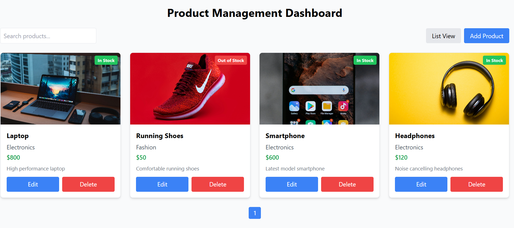
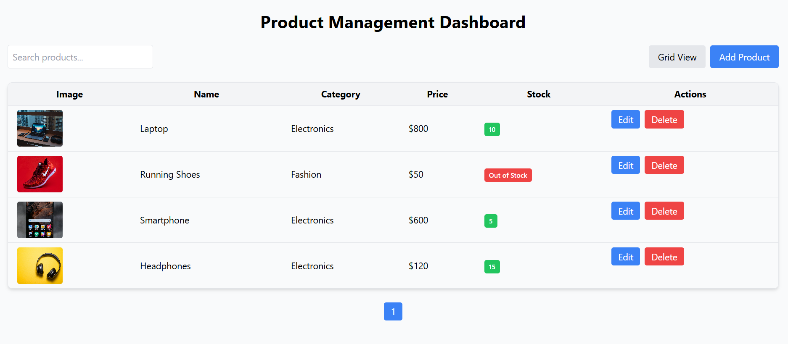
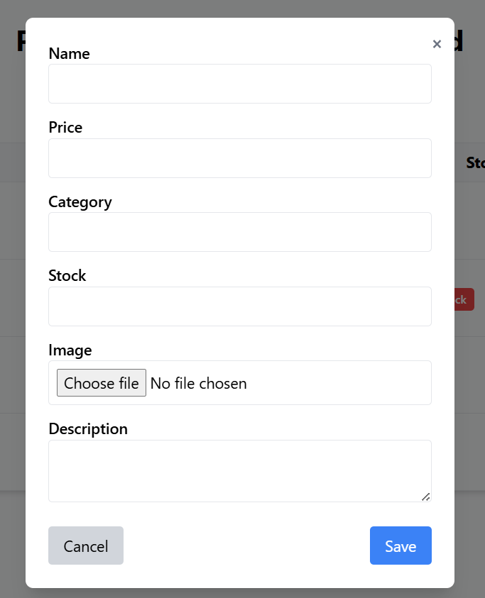

# Product Management Dashboard

A responsive **React.js** dashboard to manage products with **grid/list views, search, pagination, add/edit/delete products, and image upload**.  
No backend required — all data is stored in memory.

---

## Features

- **Product List Display**
  - Display products in **Card View (Grid)** or **List View (Table)**
  - Toggle between views with a button

- **Search Functionality**
  - Search products **in real-time** by name
  - **Debounce of 500ms** to optimize performance

- **Add/Edit Product**
  - Add or edit products with the following fields:
    - Name (required)
    - Price (number, required)
    - Category (required)
    - Stock (number)
    - Description (optional)
    - Image upload (with preview)
  - Basic **form validation** with error messages

- **Delete Product**
  - Delete any product with confirmation

- **Pagination**
  - Paginated product list (6 products per page)
  - Works in both grid and list views

- **Responsive Design**
  - Works on mobile, tablet, and desktop
  - Modern, clean UI with hover effects

---

## Technologies Used

- **React.js** (Functional Components & Hooks)
- **Tailwind CSS** for styling
- **Vite** as the development environment
- No backend (data stored in memory)

---

## Project Structure

```bash
src/
├─ components/
│ ├─ initialProducts.js
│ ├─ Modal.jsx
│ ├─ ProductCard.jsx
│ ├─ ProductTable.jsx
│ ├─ ProductForm.jsx
│ ├─ SearchBar.jsx
│ └─ Pagination.jsx
├─ App.jsx
└─ main.jsx
```

---

## Installation & Setup

1. **Clone the repository**

```bash
git clone 
cd product-management-ui
```

2. **Install dependencies**

```bash
npm install
# or
yarn

```

3. **Start the development server**

```bash
npm run dev
# or
yarn dev
```

4. Open your browser at http://localhost:5173

## Usage

1. **Toggle Views:**  
   Click the **List/Grid View button** to switch between table and card views.

2. **Search Products:**  
   Type in the search bar to filter products by name. The search is **debounced by 500ms** to prevent lag.

3. **Add Product:**  
   Click the **Add Product** button. Fill in the form fields:
   - Name (required)
   - Price (required)
   - Category (required)
   - Stock (number)
   - Description (optional)
   - Upload an image (optional)
   
   Then click **Save** to add the product.

4. **Edit Product:**  
   Click the **Edit** button on a product card or table row. Update the fields and click **Save** to update the product.

5. **Delete Product:**  
   Click the **Delete** button on a product card or table row. Confirm the deletion to remove the product.

6. **Pagination:**  
   If there are more products than the page size, use the **pagination buttons** at the bottom to navigate between pages.

---

## Screenshots

### Grid View (Card)



### List View (Table)



### Add Product Modal



### Edit Product Modal


## Image Handling

- **Image Upload:** You can upload a local image when adding or editing a product.  
- **Preview:** The uploaded image will show as a preview before saving.  
- **Fallback:** Default placeholder images are used for initial products.

---

## Notes

- All product data is stored **in memory**, so it will reset on page reload.  
- Designed to simulate a real e-commerce dashboard **without backend integration**.  
- Fully responsive for desktop and mobile screens.

---

## Future Improvements

- Persist data using **localStorage** or connect to a backend API  
- Add **category filter** and **sorting** options  
- Implement **drag-and-drop image upload**  
- Enhance UI with **animations, transitions, and theming**

---

## Author

- **Your Name** – Student / Developer  
- Email: your.email@example.com  
- GitHub: [github.com/yourusername](https://github.com/yourusername)
